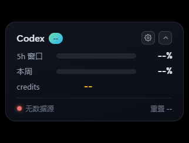
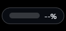
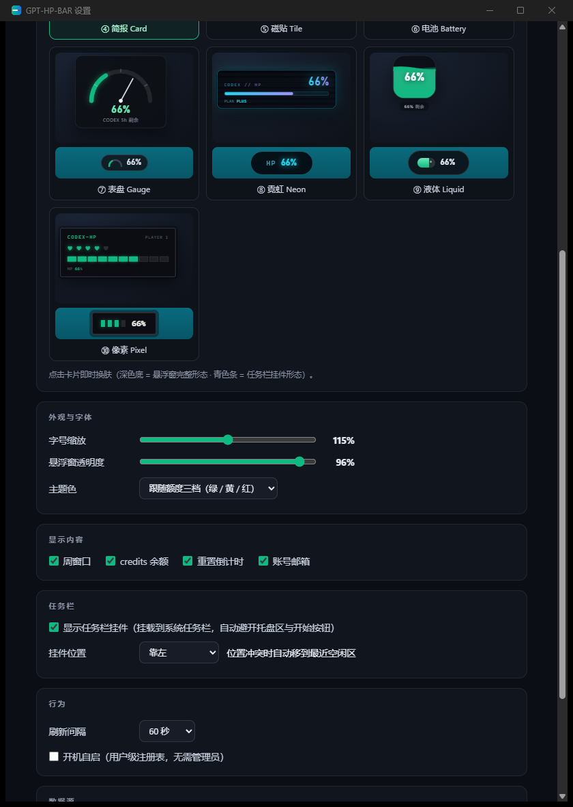

# GPT-HP-BAR

Your Codex quota, rendered as an HP bar pinned to your Windows desktop and taskbar.

[简体中文](README.md) | **English**

> Live view of your Codex 5-hour window / weekly window / credits (Codex CLI and the ChatGPT desktop app share the same account pool).
> Two forms: a floating desktop widget and a taskbar widget, with 10 switchable themes. Runs 100% locally.

<p>
  
  &nbsp;
  
</p>

## Features

- **Two forms** — an always-on-top borderless floating widget (draggable, full/compact layouts) plus a mini widget docked on the system taskbar
- **10 themes, one click away** — the settings panel renders live previews with each theme's real markup and styles (no more switching back and forth); click a card to apply instantly
- **Smart taskbar avoidance** — works on Windows 10 and 11: keeps clear of the tray area, Start button and pinned app icons (read via UI Automation, since the real icon positions aren't exposed by legacy window structures on modern Win11); coexists with third-party taskbar widgets like TrafficMonitor; re-docks within 2 seconds as the icon group grows or shrinks; slides to the nearest free spot on conflict
- **Appearance** — font scale 80–150%, window opacity, accent color (follow the 3-tier quota state, or fixed green/amber/cyan), four content toggles (weekly / credits / reset countdown / email); every change applies live
- **Tray integration** — tray icon tinted by remaining quota (green >50% / amber >20% / red ≤20%), menu for show/settings/refresh/exit
- **Auto start** — per-user registry (HKCU), no admin rights needed

## Screenshot

The settings panel previews every theme live (top: full floating form; bottom teal strip: taskbar widget form):



## Data source & account

Sources are probed in priority order with automatic fallback:

1. **Codex CLI's built-in app-server** (JSON-RPC: `account/read`, `account/rateLimits/read`) — official process; token renewal stays with the Codex CLI
2. **Direct** `chatgpt.com/backend-api/wham/usage` (Bearer token read from `~/.codex/auth.json`)
3. **Relay / third-party providers** — probes a wham/usage-compatible endpoint at the `base_url` of the `model_provider` in Codex's `config.toml`

- Run `codex login` once and real quota shows up; otherwise the widget says "no data source"
- Tolerates both `rate_limit` / `rate_limits` spellings and `additional_rate_limits[]`
- Troubleshooting: `gpt-hp-bar.exe --probe` (prints probe results, never prints secrets)

**Privacy**: everything runs on your machine. The token is only used in-memory for local queries. No telemetry, nothing leaves your computer.

## Download & run

Grab the single-file `gpt-hp-bar.exe` from [Releases](../../releases) (no installer). Requires Windows 10/11 + WebView2 Runtime (preinstalled on Win11).

Build from source:

```bash
git clone https://github.com/FeamCoco/GPT-HP-BAR.git
cd GPT-HP-BAR/app
cargo build --release
./target/release/gpt-hp-bar.exe          # floating widget + tray
./target/release/gpt-hp-bar.exe --probe  # data source diagnostics
```

Toolchain: Rust stable. The standard MSVC route just needs [VS Build Tools](https://visualstudio.microsoft.com/downloads/);
no admin rights? Use a portable [MinGW-w64](https://winlibs.com/) — copy `app/.cargo/config.example.toml` to `config.toml` in the same folder and point it at your gcc.

## The 10 themes

| # | Name | Style |
|---|---|---|
| ① | Hero | Game-style HP bar: segmented gauge, 3-tier tinting, low-HP blink |
| ② | Glass | Frosted-glass capsule: minimal single line |
| ③ | Term | htop-style: monospace + █░ progress blocks |
| ④ | Card | Info card: dual windows + credits · **default** |
| ⑤ | Tile | Fluent tile: big number + white progress line |
| ⑥ | Battery | Battery metaphor: the icon is the quota |
| ⑦ | Gauge | Semi-circle dial with springy needle |
| ⑧ | Neon | Gradient sweep gauge + glowing digits |
| ⑨ | Liquid | Liquid level = remaining quota, dual waves |
| ⑩ | Pixel | 8-bit: 5 hearts + blocky HP bar |

A theme = `app/frontend/skins/<id>.css` (styles scoped under `.sk-<id>`) + `<id>.js` (registers into `window.SKINS`, providing both the full and the taskbar mini form). Adding a theme takes just two files.

## Configuration

- Settings file: `%APPDATA%\GPT-HP-BAR\settings.json` (changes save and apply instantly)
- Account data: `CODEX_HOME` (defaults to `~/.codex`)
- Open settings: the gear on the floating widget, or right-click the tray icon → "设置…"

## Repository layout

```
app/
  src/main.rs        # windows / tray / polling / taskbar placement (Win32 + UIA avoidance)
  src/datasource.rs  # data source fallback chain
  src/settings.rs    # settings persistence & auto start
  frontend/          # floating widget / taskbar widget / settings panel (skins/ = 10 themes)
docs/                # requirements & design notes (data source research, taskbar avoidance algorithm)
```

## Roadmap

- [ ] Low-quota alert (threshold notification)
- [ ] Usage trend sparkline
- [ ] Secondary-monitor taskbar support
- [ ] Localized UI

## License

[MIT](LICENSE) © 2026 FeamCoco
